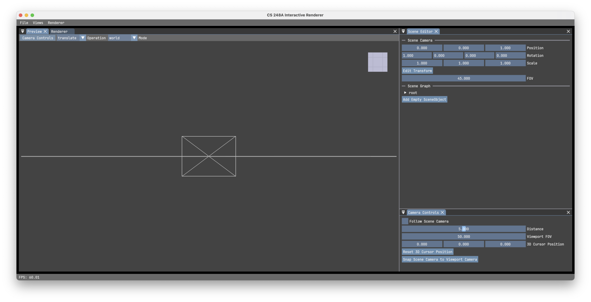

# Installation Guide

This guide will help you set up the **CS248A Volumetric Renderer** on your local machine.

## Prerequisites

Before you begin, ensure you have the following:

-   **OS**: Windows 10/11, macOS 12+, or a modern Linux distribution (Ubuntu 22.04+ recommended).
-   **Hardware**: A GPU with Vulkan 1.2+ support (or Metal on macOS).
-   **Git**: Installed and configured.
-   **Python**: Version 3.10 or newer.

---

## Step 1: Clone the Repository

Open your terminal (or PowerShell on Windows) and clone the repository. We recommend using HTTPS if you haven't set up SSH keys.

```bash
# Clone the repository
git clone https://github.com/stanford-cs248/cs248a-renderer-internal.git

# Enter the directory
cd cs248a-renderer-internal

# Initialize submodules
git submodule update --init --recursive
```

> **Note**: If you prefer SSH, you can use `git@github.com:stanford-cs248/cs248a-renderer-internal.git`.

---

## Step 2: Platform-Specific Setup

Choose your operating system below to install the necessary build tools and graphics drivers.

### Linux

**1. Install System Dependencies**

You need a C++ compiler, CMake, and the Vulkan SDK.

*   **Debian / Ubuntu**:
    ```bash
    sudo apt update
    sudo apt install build-essential cmake libvulkan-dev vulkan-tools xorg-dev libglu1-mesa-dev
    ```

*   **Arch Linux**:
    ```bash
    sudo pacman -Syu base-devel cmake vulkan-devel
    ```

**2. Verify Vulkan**
Run `vulkaninfo` in your terminal. If it outputs a lot of text without errors, you are ready.

**3. Install `uv`**
We use `uv` for fast Python package management.
```bash
curl -LsSf https://astral.sh/uv/install.sh | sh
```
*Restart your terminal after installation if `uv` is not found.*

---

### Windows

**1. Install Build Tools**

*   **Visual Studio 2022**: Install the [Visual Studio Community](https://visualstudio.microsoft.com/downloads/).
    *   Select the **"Desktop development with C++"** workload.
    *   Ensure **"CMake"** is checked in the "Individual components" tab.
*   **Git for Windows**: Install [Git for Windows](https://git-scm.com/download/win).
*   **Python**: Install [Python 3.10+](https://www.python.org/downloads/windows/).
    *   **Important**: Check **"Add Python to PATH"** during installation.

**2. Install Vulkan SDK**
Download and install the [Vulkan SDK](https://vulkan.lunarg.com/sdk/home).
*   Open PowerShell and run `vulkaninfo` to verify.

**3. Install `uv`**
Open **PowerShell** and run:
```powershell
irm https://astral.sh/uv/install.ps1 | iex
```
*Restart PowerShell after installation.*

---

### macOS

**1. Install Xcode & Command Line Tools**

*   Install **Xcode** from the App Store.
*   Install the Command Line Tools:
    ```bash
    sudo xcode-select --install
    ```

**2. Configure Metal Toolchain**

*   Ensure the developer directory is correct:
    ```bash
    sudo xcode-select -s /Applications/Xcode.app/Contents/Developer
    ```
*   Open Xcode, go to **Settings > Components > Other Components**, and install the **Metal Toolchain**.
*   Verify by running: `xcrun metal --version`.

**3. Install `uv`**
```bash
curl -LsSf https://astral.sh/uv/install.sh | sh
```
*Restart your terminal after installation if `uv` is not found.*

---

## Step 3: Install Project Dependencies

Now that your system is ready, install the Python dependencies using `uv`. This works the same on all platforms.

1.  **Sync Dependencies**:
    ```bash
    uv sync
    ```

2.  **Activate Virtual Environment**:

    *   **Linux / macOS**:
        ```bash
        source .venv/bin/activate
        ```
    *   **Windows (PowerShell)**:
        ```powershell
        .venv\Scripts\Activate.ps1
        ```

Your prompt should now show `(.venv)`.

---

## Step 4: Run the Application

Launch the renderer:

```bash
python -m cs248a_renderer
```

If everything is set up correctly, you should see a window that shows an empty scene like this:



If you want to learn how to use the interactive renderer, please refer to the [interactive renderer guide](interactive-renderer.md).

> **Troubleshooting**:
> *   **Linux**: If the window doesn't appear, ensure you are in a desktop environment (not a headless SSH session).
> *   **Windows**: If you get a "Script is not signed" error when activating, run `Set-ExecutionPolicy -ExecutionPolicy RemoteSigned -Scope CurrentUser` in PowerShell.

---

## Step 5: VS Code Setup (Optional)

For the best experience writing Slang shaders and Python notebooks, we recommend using **Visual Studio Code**.

1.  **Install VS Code**: Download it from [code.visualstudio.com](https://code.visualstudio.com/).
2.  **Install Extensions**:
    *   **Slang**: Search for "slang" in **Extensions** (on the left sidebar of VS Code) and install **"The Slang Shading Language VSCode Extension"** (shader syntax highlighting and intellisense).
    *   **Python**: Install the official **Python** extension (for notebook support).