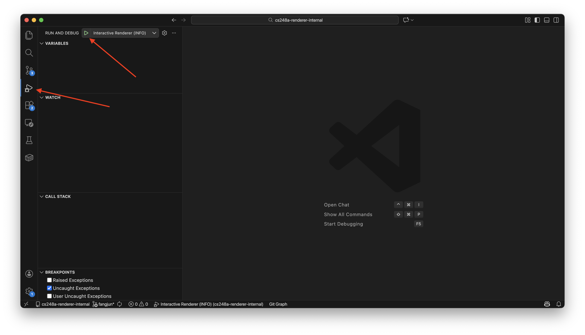
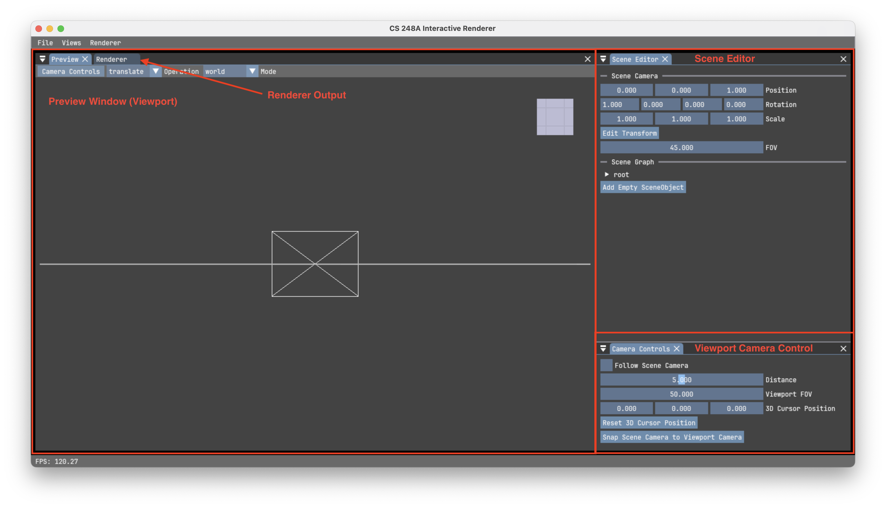
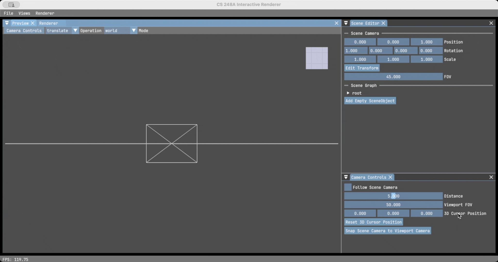
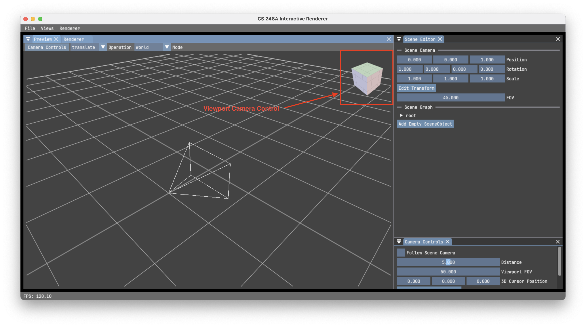
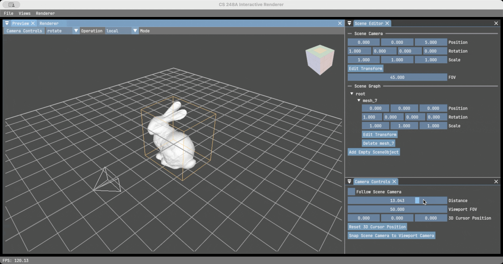
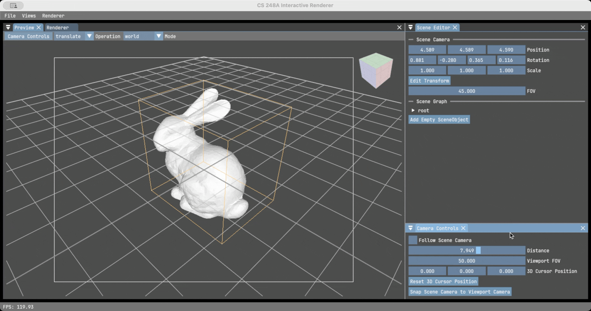

# CS 248A Interactive Renderer Guide

This document provides instructions on how to use the interactive renderer included in the CS 248A assignment repository.

## Prerequisites

Make sure you have completed the installation steps outlined in the [installation guide](installation.md) before proceeding with the interactive renderer.

## Running the Interactive Renderer

Make sure the virtual environment for the project is activated. If you have not activated it yet, follow the *Activate the Virtual Environment* step in the installation guide.

To start the interactive renderer, run `python -m cs248a_renderer` from the root directory of the project.

If you are using VSCode, you can also run the renderer with python debugging support by selecting the `Interactive Renderer (INFO)` or `Interactive Renderer (DEBUG)` configuration from the Run and Debug panel.

> Note: You may see a slang warning showing `[WARN] No supported shader model found, pretending to support sm_6_0.`. You can ignore this warning.

> Note: If you are running on macOS, you may see additional warnings `objc[15981]: Class ... is implemented in both ... and ... This may cause spurious casting failures and mysterious crashes. One of the duplicates must be removed or renamed.`. These warnings can also be ignored.

## Using the Renderer

Once the renderer is launched, you'll see a window similar to the following screenshot

On the left side of the window is the preview window and the render output window. On the right side is the scene editor panel and the camera control panel.

### Layout and Panel Docking

You can reorganize the layout of the pannel by dragging and dropping the panels to your preferred locations. If you closed a panel, you can reopen it from the view menu in the top menu bar.

### Viewport Camera Controls

To navigate the 3D scene, use the following controls if you are using a mouse and keyboard (you might be familiar with these controls if you have used Blender before):

- **Orbit**: Middle mouse button + drag
- **Pan**: Shift + Middle mouse button + drag
- **Zoom**: Scroll wheel

If you are using a trackpad, use the following controls:

- **Orbit**: Drag the viewport camera control cube on the top right corner of the preview window
- **Pan**: Adjust the 3D cursor position in the camera control panel
- **Zoom**: Scroll up/down with two fingers or adjust the camera distance in the camera control panel

You can always snap the camera to a certain axis by clicking the corresponding face of the camera control cube.

### Loading 3D Models

To load a 3D model into the scene, click the `File > Load > Mesh` menu in the top menu bar. Currently, only `.obj` files are supported.

### Editing the Scene

You can edit the scene using the scene editor panel on the right side of the window. Click the `Edit Transform` button of the object you want to edit and a gizmo will appear in the preview window. You can select the translation, rotation, or scale operation and local or global mode from the preview window toolbar.

In the scene editor pannel, you can drag and drop to change all the field of position, rotation, and scale. If you want to type in a value for a field, double click it to enable the text field.

You can reparent objects by dragging and dropping them in the scene graph hierarchy (after you implement the hierarchical transform correctly in the assignment 1).

To edit the camera transform, you can click the `Edit Transform` button for the scene camera in the scene editor panel. You can also click the `Snap Scene Camera to Viewport Camera` in the camera control panel to quickly set the scene camera to the current viewport camera position. If you want to see through the scene camera, toggle the `Follow Scene Camera` switch in the camera control panel.

Once you've set up the scene and camera, you can click the `Renderer > Render` menu in the top menu bar or the `Render` button in the render output window to start rendering the scene.

